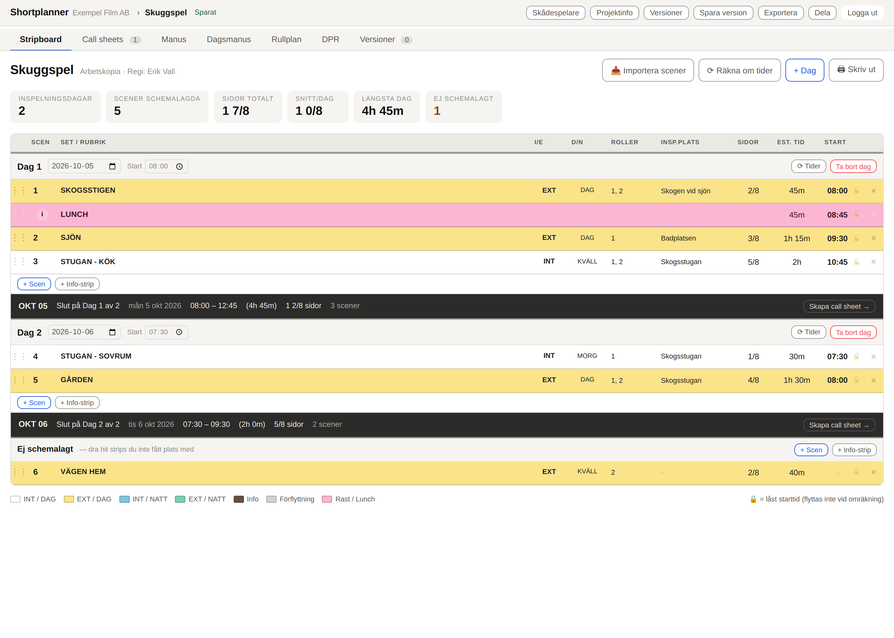
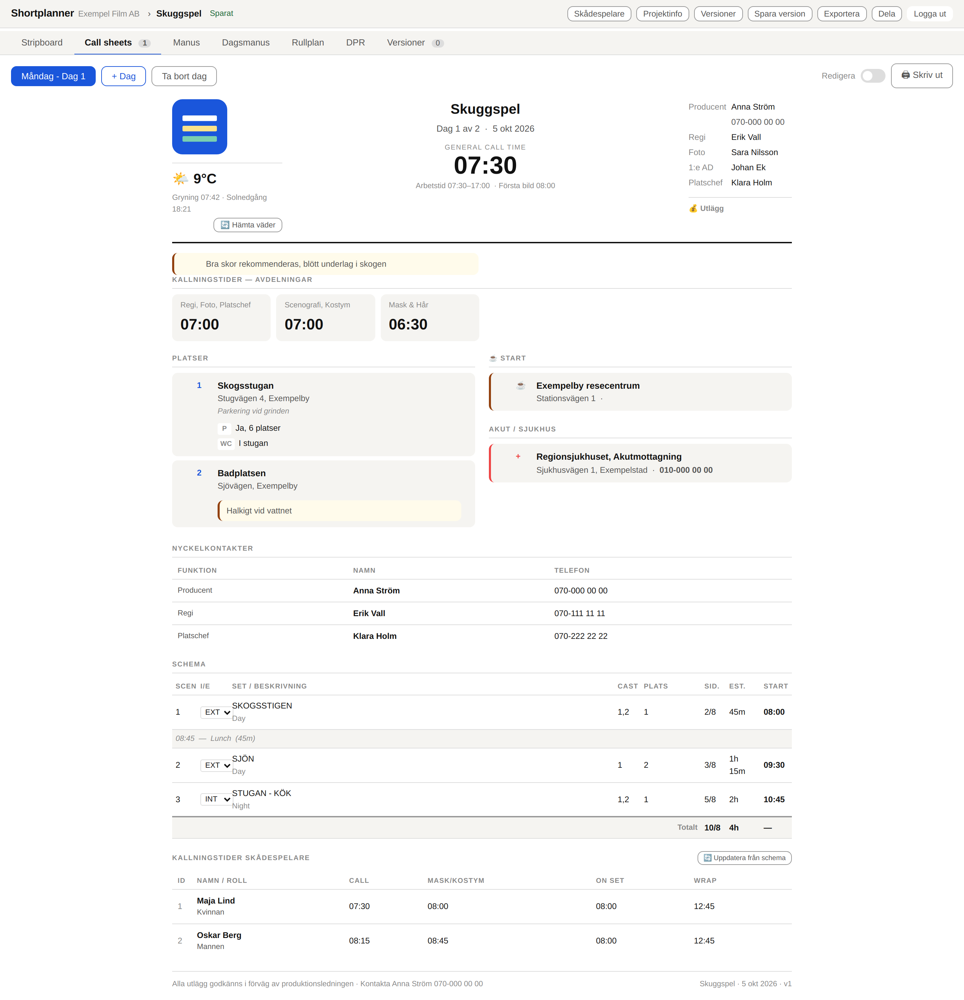

# Shortplanner

[English](README.md) · **Svenska**

Stripboard, call sheets, dagsmanus och produktionsbudget för filmproduktion — självhostat, en container, en SQLite-fil, ett lösenord.

Byggt för korta, låg­budget­produktioner där en enda person (ofta 1:e AD eller producent) sköter schemat, och resten av teamet bara behöver läsa det på en telefon utan täckning.




## Livedemo

### 👉 <https://shortplanner-demo.soxbox.uk> — logga in med lösenordet `demo`

En publik instans som kör exakt den här koden, så du kan prova Shortplanner utan att installera något. Den är laddad med **”Skuggspel”**, en påhittad tvådagars kortfilm (ingen verklig produktionsdata). Värt att göra:

- dra strips i stripboardet och se hur starttider och dagens arbetstidsvarningar räknas om;
- tryck **Skapa call sheet →** i en dagfot för att generera en call sheet, och slå sedan på **Redigera** för att ändra i den;
- öppna **🎬 Inspelningsläge** (bredvid DPR-fliken) för att se steg-för-steg-läget på inspelningsplatsen;
- öppna **Dela** för en skrivskyddad delningslänk och välj vilka delar den visar.

**Allt du ändrar nollställs varje natt kl 00:00 (svensk tid)** till utgångsläget, så ändra fritt. Att skapa, importera, duplicera och ta bort projekt är avstängt; allt annat fungerar. Den körs på en hemmaserver i mån av tid — räkna med att den kan vara långsam eller nere ibland. Vill du köra en egen, se [Köra en publik demo](#köra-en-publik-demo) längre ner.

## Funktioner

- **Stripboard** — dra och släpp strips (funkar på pekskärm), automatiskt beräknade starttider, färgkodning INT/EXT, dag/natt, rast/lunch och förflyttning, sid- och tidssummor per dag. Varningar på dagen när en dag bryter mot en arbetstids- eller viloregel (lång dag, ingen rast/lunch, för kort dygnsvila efter föregående inspelningsdag) — gränsvärden per projekt. Importera scener från ett importerat manus, eller från en stripboard-JSON (från en annan Shortplanner-installation).
- **Call sheets** — genereras från en stripboarddag med ett klick, redigeras sedan fritt. Väder hämtas automatiskt (SMHI/MET Norway), kallningstider för skådespelare räknas fram från schemat, platser med QR-koder till Google Maps, redigeringsläge som skyddar mot råkade ändringar. En call sheet vars stripboarddag ändrats efter att den genererades märks som inaktuell.
- **Manus** — importera ett manus (PDF eller Fountain), se varje scens status mot planen (schemalagd/boneyard/saknas).
- **Dagsmanus** — sidor för varje inspelningsdag, härledda live ur manus + stripboard, tryckoptimerade (A5).
- **Rullplan** — budget för fysisk film (16mm): skärmtid, skjutförhållande, rullar, med en utfallskolumn du fyller i vid wrap och ett budget-burn-block (budget/förbrukat/kvar).
- **DPR** — daglig produktionsrapport genererad från call sheeten: scenstatus, sidor tagna, faktiska tider.
- **Inspelningsläge** — ett avskalat helskärmsläge för 1:e AD:ns telefon under inspelning: gå igenom dagen ett steg i taget (scener, luncher, förflyttningar) med stora knappar som stämplar de faktiska tiderna, så DPR:n nästan fyller i sig själv. Tryck-välj aktuell scen ur ordning, tryck-korrigera en stämplad tid.
- **Skådespelarregister** — ett litet register (ID, roll, namn) som driver en multi-check-dropdown i både stripboardets Roller-kolumn och call sheetens schema.
- **Delning** — en skrivskyddad länk per projekt, ingen inloggning krävs för mottagaren, med per-komponent-val av vad länken visar (stripboard, call sheets, manus, dagsmanus, rullplan); respekterar sajtens av/på-flaggor.
- **Platser med QR** — koordinater, parkering/toalett/faciliteter och säkerhetsnoteringar per inspelningsplats. Skriver du ut call sheeten blir varje plats en skannbar QR-kod till Google Maps.
- **Offline-läsning** — installera som app (PWA); senast hämtad call sheet/stripboard/dagsmanus går att läsa utan täckning på inspelningsplatsen.
- **Sajtinställningar** — företagsnamn/logga (ersätter Shortplanners inbyggda), stäng av flikar (Rullplan/DPR) du inte använder.
- **Projekt & versioner** — flera produktioner i samma installation; arbetet sparas löpande, namngivna versioner fryser ett läge du kan återgå till. Optimistisk låsning varnar om samma projekt redigeras på flera enheter samtidigt.

---

## 1. Förberedelser på servern

Peka DNS mot serverns IP:

```
shortplanner.example.com.   A   <serverns IPv4>
shortplanner.example.com.   AAAA <serverns IPv6, om du har>
```

Kräver Docker och Docker Compose-pluginet:

```bash
docker --version
docker compose version
```

## 2. Installera

```bash
# lägg katalogen på servern, t.ex. /opt/shortplanner
git clone https://github.com/Svenbox/shortplanner.git /opt/shortplanner
cd /opt/shortplanner

cp .env.example .env
nano .env          # sätt APP_PASSWORD
```

Generera gärna ett riktigt lösenord och en sessionshemlighet:

```bash
openssl rand -base64 24   # -> APP_PASSWORD
openssl rand -hex 32      # -> SESSION_SECRET
```

Starta:

```bash
docker compose up -d --build
docker compose logs -f    # ska säga "Shortplanner kör på port 3000"
```

Appen lyssnar nu på `127.0.0.1:8080` — bara lokalt på servern. Nästa steg publicerar den.

## 3. Publicera med TLS

### Alternativ A: Caddy (enklast, sköter certifikat själv)

```bash
sudo apt install caddy
sudo cp deploy/Caddyfile /etc/caddy/Caddyfile     # eller klistra in blocket i din befintliga
sudo systemctl reload caddy
```

### Alternativ B: Nginx

```bash
sudo cp deploy/nginx.conf /etc/nginx/sites-available/shortplanner.example.com
sudo ln -s /etc/nginx/sites-available/shortplanner.example.com /etc/nginx/sites-enabled/
sudo certbot --nginx -d shortplanner.example.com
sudo nginx -t && sudo systemctl reload nginx
```

### Alternativ C: Traefik

Kör `deploy/docker-compose.traefik.yml` istället för `docker-compose.yml`. Det förutsätter ett externt nätverk `traefik` och en certresolver som heter `le`.

Öppna sedan **https://shortplanner.example.com** och logga in med lösenordet från `.env`.

> Kör inte appen utan TLS över internet. Lösenordet skickas i klartext över HTTP, och sessionscookien sätts bara med `Secure`-flaggan när proxyn skickar `X-Forwarded-Proto: https`.

---

## Så används appen

**Projekt** är utgångsläget. Skapa ett tomt projekt, eller duplicera/importera ett befintligt. **Projektinfo** (i topplisten inne i ett projekt) håller grunduppgifter — titel, bolag, producent, regi, foto, 1:e AD, platschef, inspelningsdatum, format — som förifyller nya call sheets när de skapas. Här ligger också arbetstidsreglerna stripboardet stämmer av varje dag mot: max arbetstid/dag, lunch senast efter samling, minsta dygnsvila mellan inspelningsdagar (i timmar; tomt = standard 10 / 5 / 11).

**⚙ Inställningar** (på projektlistan) gäller hela installationen: företagsnamn/logga för call sheets, och av/på för Rullplan- och DPR-flikarna om du inte använder dem.

**Stripboard-fliken**

- Dra i handtaget (⋮⋮) för att flytta en strip — inom en dag, mellan dagar, eller till och från banken *Ej schemalagt* längst ner. Funkar med mus eller finger. **⋯**-menyn på en strip flyttar den till en viss dag (eller till *Ej schemalagt*) utan att dra.
- Sidor, est. tid, I/E och DAG/NATT är dropdowns. I/E och DAG/NATT styr stripens färg.
- Ändrar du est. tid räknas efterföljande starttider om automatiskt.
- 🔒 låser en starttid så den inte flyttas vid omräkning. Skriver du in en tid manuellt låses den automatiskt — så behåller du medvetna luckor i dagen.
- Dagar över 12 timmar flaggas gult i dagfoten. Utöver det visar dagfoten en varningsrad när en dag bryter mot en arbetstidsregel från **Projektinfo**: arbetstid (dagens spann minus rast/lunch-strips) över gränsen, ingen rast/lunch inplanerad eller lunch för långt efter samling, eller mindre än minsta dygnsvila mellan föregående inspelningsdags slut och den här dagens samling. En röd varning gör dessutom dagens spann-siffra röd.
- **Duplicera dag** i dagfoten kopierar en hel inspelningsdag (alla strips, datumet tomt) som en ny dag.
- **📥 Importera scener** skapar en strip per scen i ett importerat manus (i "Ej schemalagt", manusordning), eller läser in en hel stripboard-fil (JSON, från en annan Shortplanner-installation eller ett eget tidigare exporterat projekt).

**Skapa call sheet →** i en dagfot bygger en call sheet av den dagen: schema med info-rader och totalrad, kallningstider (30 min före dagstart, mask 60 min före), arbetstid och rollista från scenernas roll-ID:n. Finns redan en call sheet för dagen står det **Uppdatera call sheet →** — kör den igen så uppdateras schemat medan platser, kontakter, väder och skådespelartider du fyllt i behålls. Call sheets-fliken visar en banner om att planen är inaktuell ifall stripboarddagen ändrats efter att call sheeten senast genererades.

Skriv `MOS` i en scens set/rubrik-fält för att markera att den spelas in utan ljud — vedertagen branschterm ("Mit Out Sound"), ingen särskild funktion i appen men bra att känna till.

**Manus-fliken.** Importera ett manus som PDF (numrerad tagningsmanus-konvention, scennummer i båda marginalerna) eller Fountain. Varje scen visar sin status mot den faktiska planen: schemalagd (med dag och tid), boneyard, eller saknas i planen. **↳ Skapa stripboard av scenerna** bygger strips av hela manuset på en gång om du hellre planerar utifrån manuset än tvärtom.

**Dagsmanus-fliken** genererar tryckfärdiga sidor per inspelningsdag direkt ur manus + stripboardets ordning — ingen sparad kopia, ändrar du schemat speglas det direkt.

**Rullplan-fliken** budgeterar fysisk film: skärmtid per scen (föreslås proportionellt mot manussidorna, override:as manuellt), skjutförhållande (redigerbart, standard 14:1), rullar (11 min/rulle). Slå på Redigera för att skriva in vad som faktiskt rullades per scen och markera en dag som wrappad — budget-burn-blocket visar då budget/förbrukat/kvar.

**DPR-fliken** (Daglig produktionsrapport, internt — inte med i delade länkar) genereras från en dags call sheet: bocka av scener som klara/delvis/flyttade/strukna, sidor tagna, faktiska tider mot planerade.

**Inspelningsläge.** En 🎬-knapp dyker upp i topplisten på inspelningsdagar (när en DPR-dag ligger inom ett dygn från idag), och det finns en i DPR-fliken också. Den öppnar ett helskärmsläge byggt för 1:e AD:ns telefon på inspelningsplatsen: en "starta dagen"-skärm, sedan ett steg i taget — scener, plus rast/lunch- och förflyttningsraderna från call sheeten — med general call, planerad start, stämplad faktisk start och en rullande beräknad wrap som kryper med klockan (grön/gul/röd mot planerad wrap). Stora knappar: **✓ Klar** (stämplar faktiskt slut och går vidare), **◐ Delvis**, **→ Hoppa över** (flyttar bara pekaren, lämnar steget omarkerat), **◂ Backa**, **+10 / +20 min** (lägger slip på aktuellt steg). Tryck på en rad i steglistan för att göra den till den aktuella ur ordning; tryck på ✎ på faktisk-start-raden för att korrigera en stämplad tid. Allt skrivs rakt in i DPR-dagen — lunch ut/in, första tagning och camp wrap fyller i sig själva. Kräver nät (autospar som vanligt).

**Skådespelare.** Knappen **Skådespelare** i topplisten öppnar ett litet register: ID, roll/karaktär och (valfritt) skådespelarens namn. Lägg till och ta bort fritt, redigera roll/namn genom att klicka i fälten. ID:t är det du skriver i stripboardets Roller-kolumn.

I både stripboardets Roller-kolumn och call sheetens schema är cast-fältet en knapp — klicka för att öppna en kryssruteslista över registret och välj en eller flera. Panelen stängs och sparar när du klickar utanför eller på **Klar**.

**Väder.** I call sheetens väderrad hämtar **🔄 Hämta väder** en prognos från SMHI (fallback MET Norway/Yr.no) plus gryning/solnedgång, för kl 12:00 lokal tid (Stockholm, sommar-/vintertid hanteras) den dag call sheeten gäller — baserat på adressen till första platsen i PLATSER-listan, eller sjukhusets om ingen plats har en riktig adress ännu. Fungerar bara för datum inom den närmaste veckan eller så — längre fram finns ingen prognos ännu.

**Kallningstider skådespelare.** Tabellen längst ner i call sheeten fylls i manuellt via **+ Lägg till skådespelare** (välj från registret eller skriv fritext), eller automatiskt via **🔄 Uppdatera från schema** — då räknas Call/Mask-Kostym/On set/Wrap fram per person utifrån deras faktiska första och sista scen den dagen (inte dagens allmänna starttid). Manuellt tillagda som inte förekommer i något scenschema rörs inte.

**Call sheets-fliken** har en redigeringsknapp uppe till höger. Slå på den för att ändra fält och lägga till rader (inklusive "+ Lägg till skådespelare"); slå av den för att läsa och skriva ut. Platser och OBS-noteringar går att dra om i ordning i redigeringsläge — ta tag i handtaget (⋮⋮) till vänster om posten och släpp där du vill ha den; OBS-noteringar visas i två kolumner. Avdelningsrutor under Kallningstider går att ta bort med krysset i hörnet.

**Sidtitel.** Webbläsarfliken (och därmed det föreslagna filnamnet när man skriver ut till PDF) speglar vad man tittar på — "Projektnamn – Stripboard", eller "Projektnamn – Call sheet – Måndag - Dag 1" och så vidare när man byter dag. Gäller både den inloggade appen och den publika delningslänken.

**Platser.** Varje plats i PLATSER-blocket — och Akut/Sjukhus-rutan bredvid — kan få koordinater, parkering, toalett, övriga faciliteter och en säkerhetsnotering, alla tomma tills du fyller i dem i redigeringsläge. Koordinatfältet tar tre sorters inmatning: skriv in `65.67120, 21.98430` direkt (komma eller punkt som decimaltecken går båda bra), klistra in en hel Google Maps-länk (koordinaterna plockas ur `@lat,lng`, `?q=`, `?query=` eller den inbäddade `!3d!4d`-datan — en kort `maps.app.goo.gl`-länk utan synliga koordinater följs och löses upp server-sidan), eller klicka **📍 Från adress** för att slå upp koordinater automatiskt från adressfältet (Nominatim/OpenStreetMap). Koordinaterna är sanningen: så fort en plats har dem visas en klickbar "📍 Karta"-länk på skärmen, och vid utskrift ersätts länken av en QR-kod till samma Google Maps-position — genererad som inline-SVG i webbläsaren, ingen tredjepartstjänst inblandad. START/SLUT (dagens utgångspunkt/övernattning) ärvs mellan dagar och visar bara en kartnål på mobil tills du fäller ner adressen. Väntar du dålig mobiltäckning på en inspelningsplats, lägg till en **offline-varning** för den dagen — den påminner om att ladda ner offlinekartor i förväg, eftersom QR-koderna kräver nät för att slå upp adressen skannad.

> Kontrollera alltid QR-koderna innan en plan går ut till teamet: skriv ut till PDF (eller på riktigt) och skanna varje kod, inte bara ett stickprov.

**Dela.** Knappen **Dela** i topplisten genererar en skrivskyddad länk (`/share/<token>`) — ingen inloggning krävs för att se den, alla redigeringskontroller är borttagna. Fem kryssrutor väljer vad länken visar: Stripboard, Call sheet, Manus, Dagsmanus, Rullplan. Alla är på från början; kryssar du ur en slår det igenom på samma länk direkt (token ändras inte). Manustexten skickas bara när Manus eller Dagsmanus delas — med bara Rullplan ikryssad får länken scennummer, sluglines och sid-/skärmtidssiffror men ingen manusbrödtext. DPR (internt) är aldrig med. **Ta bort delning** ogiltigförklarar länken direkt.

**Versioner.** Allt sparas löpande — indikatorn uppe i topplisten visar *Sparat HH:MM*. När du vill frysa ett läge klickar du **Spara version** och namnger det. Vid **Återställ** sparas nuvarande läge automatiskt som *Före återställning* först, så du kan aldrig måla in dig i ett hörn. Redigerar samma projekt på två enheter samtidigt varnar appen och låter dig välja vilken version som gäller, istället för att tyst skriva över.

**Offline.** Shortplanner går att installera som en app (PWA) från webbläsaren. Senast hämtade call sheet, stripboard och dagsmanus går att läsa utan nätverk — praktiskt på inspelningsplatser utan täckning. Att redigera kräver fortfarande nät.

---

## Drift

**Uppdatera till en ny version av koden**

```bash
cd /opt/shortplanner
git pull
docker compose up -d --build
```

Databasen ligger i en namngiven volym och rörs inte av ombyggen.

**Versionshantering av koden.** Katalogen är ett git-repo — varje meningsfull kodändring bör committas, så att ett misstag går att slå upp och backa med `git log` / `git diff` / `git checkout -- <fil>`. Committa inte `.env` (redan i `.gitignore`).

**Säkerhetskopiera**

```bash
docker run --rm -v shortplanner_shortplanner-data:/data -v "$PWD":/backup \
  alpine tar czf /backup/shortplanner-$(date +%F).tar.gz -C /data .
```

Lägg den raden i cron en gång i veckan. Exportknappen i appen ger dessutom en JSON-fil per projekt inklusive alla versioner — bra att ha som separat kopia.

**Återläs en säkerhetskopia**

```bash
docker compose down
docker run --rm -v shortplanner_shortplanner-data:/data -v "$PWD":/backup \
  alpine sh -c "rm -rf /data/* && tar xzf /backup/shortplanner-2026-08-20.tar.gz -C /data"
docker compose up -d
```

**Byta lösenord**

Ändra `APP_PASSWORD` i `.env` och kör `docker compose up -d`. Redan inloggade enheter fortsätter fungera tills sessionen går ut — vill du logga ut alla direkt byter du även `SESSION_SECRET`.

**Loggar och status**

```bash
docker compose logs -f
docker compose ps          # healthcheck syns i STATUS
```

**Om en ändring inte syns efter omstart** — kolla cachning innan du misstänker koden. Servern skickar `Cache-Control: no-cache` på statiska filer och sätter en `X-App-Version`-header (hash av tillgångarna) som klienten pollar mot — en flik som stått öppen visar en "ny version finns"-banner istället för att tyst köra gammal kod. En service worker cachar sidan för offline-läsning; den upptäcker och hämtar en ny version automatiskt, men om något ändå ser gammalt ut: `SW_DISABLED=1` i miljön får den att avregistrera sig själv.

---

## Under huven

| | |
|---|---|
| Server | Node 22, Express, better-sqlite3 |
| Databas | SQLite i volymen `/data/shortplanner.db` (WAL) |
| Inloggning | Ett lösenord från `APP_PASSWORD`, HMAC-signerad cookie, 30 dagar |
| Bruteforce-skydd | 10 misslyckade försök per IP per 15 minuter |
| Klient | Vanilla JS, inga byggsteg, ingen CDN, PWA med offline-cache |

**API** (allt kräver inloggningscookie utom login/version/site-public/share/logo)

```
POST   /api/login                        { password }
POST   /api/logout
GET    /api/me
GET    /api/version                                        build-id, för klientens versionskoll
GET    /api/site                                            sajtinställningar (auth)
PUT    /api/site                         { ... }
GET    /api/site/public                                     publik delmängd (namn/logga/flaggor/språk)
POST   /api/site/logo                    { dataUrl }         data-URL png/jpg/svg/webp, max 2 MB
DELETE /api/site/logo
GET    /logo                                                 publik, den uppladdade loggan (404 om ingen)
GET    /api/projects
POST   /api/projects                     { name }
GET    /api/projects/:id
PATCH  /api/projects/:id                 { name }
DELETE /api/projects/:id
POST   /api/projects/:id/duplicate
POST   /api/projects/:id/share       { components? }        → { token, url, components } (skapar vid behov, annars befintlig)
DELETE /api/projects/:id/share                               ogiltigförklarar delningslänken
GET    /api/share/:token                                     publik, oautentiserad — de valda dokumenten + site + components[]
PUT    /api/projects/:id/doc/:kind       { data, baseUpdatedAt? }  kind = stripboard | callsheet | script | dpr | meta
GET    /api/projects/:id/export
POST   /api/projects/import
GET    /api/projects/:id/versions
POST   /api/projects/:id/versions        { label, note }
GET    /api/versions/:vid
PATCH  /api/versions/:vid                { label, note }
POST   /api/versions/:vid/restore
DELETE /api/versions/:vid
GET    /api/weather?address=&date=                          geokodar (Nominatim) → SMHI/MET Norway + sunrise-sunset.org
GET    /api/geocode?address=                                 geokodar (Nominatim) → { lat, lng, place }
GET    /api/resolve-maps-link?url=                           följer en kort Google Maps-länk, domän-allowlistad
```

`PUT .../doc/:kind` stödjer optimistisk låsning: skicka med `baseUpdatedAt` från senast hämtade dokument, servern svarar 409 om någon annan hunnit spara emellan.

## Köra en publik demo

Sätt `DEMO_MODE=1` så blir appen trygg att exponera för vem som helst: att skapa, importera, duplicera och ta bort projekt nekas (403), och klienten visar en ”DEMO”-badge plus en intro-overlay. Allt annat — redigera dokument, versioner, delning — funkar fortfarande, så kombinera med en schemalagd nollställning.

`deploy/docker-compose.demo.yml` är en färdig tjänst (`DEMO_MODE=1`, trivialt lösenord `demo`, egen volym, localhost-port 8092 — sätt din proxy framför). `deploy/demo-reset.sh` återställer instansen från en seed-databas och är tänkt att köras från cron; kommentaren överst i skriptet visar hur man fångar seed-filen från en instans i önskat läge. Exempelrad i crontab för nattlig nollställning i värdens tidszon:

```
0 0 * * *  /sökväg/till/shortplanner/deploy/demo-reset.sh >> /var/log/sp-demo-reset.log 2>&1
```

## Köra lokalt utan Docker

```bash
npm install
APP_PASSWORD=test1234 DATA_DIR=./data PORT=3000 node server.js
# http://localhost:3000
```

---

## Bidra

Buggrapporter och förslag är välkomna som issues. Se [CONTRIBUTING.sv.md](CONTRIBUTING.sv.md) för hur man kör projektet lokalt och skickar en pull request.

## Licens

[MIT](LICENSE).
